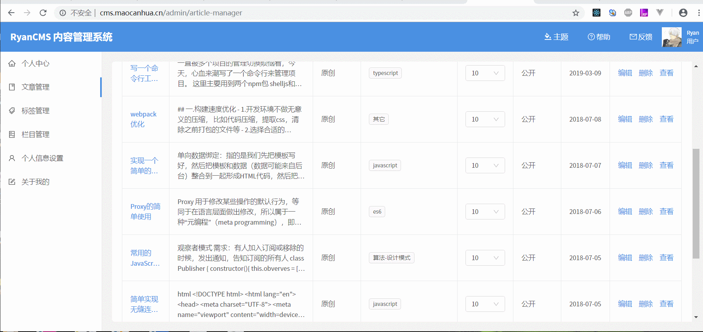

# RyanCMS

- **[项目地址 -多博客模式（允许多个用户使用）](http://cms.maocanhua.cn)**
- **[项目地址 -单博客模式](http://www.maocanhua.cn)**


特点：

- [x] 服务端渲染

- [x] typeScript

- [x] 动态设置主题颜色

  - 

- [x] 快
  - 访问快
    - 服务端渲染，秒开
    - 
  - 开发快
    - 在服务端模拟浏览器环境，调用 ReactDOMServer.render 渲染 组件收集状态，再将状态注入回组件。流程与前端开发几乎没有区别，只需要注意两点
      - 服务端渲染的数据必须存放到 redux
      - 获取完数据可以渲染界面时 调用 store.endSSR()
        - 

- [x] react-hooks 实践（略难，不适合新手）

---

**如何使用**

```js
 git clone git@github.com:m-Ryan/RyanCMS.git
```

### 修改 app/app.module.ts 的数据库配置=> host、username、password

### 首次初始化数据库 需要开启 synchronize: true,

```js
const ormConfig = {
  type: "mysql",
  host: process.env.MAIN_SERVER,
  port: 3306,
  username: process.env.MYSQL_USER_NAME,
  password: process.env.MYSQL_PASSWORD,
  database: "cms",
  entities: ["**/**.entity{.ts,}"],
  synchronize: true,
  cache: true,
  logging: false,
};
```

> 首次使用请先安装依赖

- npm install 或者 yarn

  ### 1.本地开发

  - yarn start

  ### 2.生产环境

  - yarn production

打开 http://localhost:8080/ 即可预览

---

### 单博客模式

默认是多博客模式（/u/xxx），如果想以单博客模式(/)，只需要做以下两步

- 1. 绑定独立域名
     

- 2. 配置 nginx

  ```
  server {
      listen 80;
      server_name  www.maocanhua.cn;

      location / {
           proxy_set_header ACCEPT-HOST $host;
           proxy_pass http://localhost:8080;
      }
  }

  ```

### 如果不想搭博客，又想在自己的域名下有个博客(面试的时候有个博客是加分项)，可以配置 nginx 映射到绑定我的域名下（需要注意的是，数据是保留在我的数据库），只需要做以下两步

- 1. 登录http://cms.maocanhua.cn， 绑定独立域名
     

- 2. 配置 nginx

  ```
  server {
      listen 80;
      server_name  www.maocanhua.cn;

      location / {
           proxy_set_header ACCEPT-HOST $host;
           proxy_pass http://cms.maocanhua.cn;
      }
  }

  ```

**如果你喜欢或者对你有帮助，不妨给我个 star 或者 fork 一下吧 ❤️**

## 部分页面


